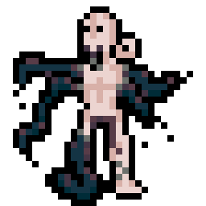

# Ecdysium



I built this little roguelike with Claude to explore the capabilities of 4.7/4.8 and get some deeper agentic coding practice. I am personally greatly inspired and entertained by [Caves of Qud](https://www.cavesofqud.com/) and [Infra Arcana](https://sites.google.com/site/infraarcana/home), than both of which this game is profoundly worse.

I chose to build a roguelike because it's a very "studied" kind of thing to build and a genre I've spent enough time with to have some opinions about. I have also never made a video game before this, so I figured it would be a good test of how well CC could compensate for my own inexperience.

So, in my defense, I didn't write a line of this myself. 😇 I have found CC to be either very productive or very verbose (depending on your perspective) as a co-worker, but also sufficiently competent (with significant prodding and correcting) to get the game into the current playable state. I don't think I could have done the same in the same amount of time without CC.

So, so far I am moderately-to-very impressed with the current SOTA of vibe coding and the capabilities of current models. I would say the biggest problem is that the game is still very shallow/repetitive, lacking the kind of depth that makes an actually-good roguelike like Caves of Qud or IA engaging and replayable - but that part is on me, not the tooling.

Working on this drove home an important point for me: that making a game worth playing is about far more than being able to write code that describes a functioning grenade or applies damage over time. 
To make a good game, the actual development loop has to expand out sometime into asking "do I enjoy playing this? do others enjoy playing this?", and that remains a very unavoidably-human question. 

## Visuals

I took the time while CC was working to hand-draw the sprites and animations in [Pixelorama](https://pixelorama.org/), so none of the visual assets are AI-generated, just the code. It took me a while to settle on a floor/wall tileset I liked for the initial biome, and you can probably guess the famous spaceship interior after which they are modeled.

Some of the assets are recolors of open source models, such as the scavenger bot, which is recolored from [Steven Challener's Scifi Creature Tileset](https://opengameart.org/content/scifi-creature-tileset-mini-32x32-scifi-creature-icons), or in the case of the survivor/player character, used as a visual reference a character sheet by [Glauber Kotaki](https://glauberkotaki.com/) (without inspiration from whom the PC would look much ... chunkier, as you can see in the "colonist" or "mutant" assets that I first drew freehand without a character reference).

I am also indebted to the Ricardo Juchem for the [darkseed-16](https://lospec.com/palette-list/darkseed-16) color palette which greatly enhanced the visual vibes.

## Gameplay tips

The various planned class features aren't fully implemented, so the HP & damage bonus from the `Security` class are probably the most straightforward actually-implemented "build" you can get benefits from.

The gameplay itself takes place in a single biome, with a short list of enemies and one "boss" on level five that is defeatable but only if you kite its attendants, use throwables, and level at least once (ideally twice) and retreat to use healing items.

My starting advice would be to proceed west into the janitor's closet to craft a chestplate and a molotov cocktail. A less obvious feature is that if you equip a utility belt (visual assets pending, sorry) then press `TAB` to access your equipment menu, you can affix your hand lamp to your belt and enjoy a larger sight radius while still using a two-handed weapon.

You heal slowly over time and the item drops in crates and on the floors are totally unbalanced, so use consumables and crafting liberally!

## Quickstart

Prerequisites:
- Rust 2024 (`rustc 1.85+`), installed via `rustup`.
- `cargo` on `$PATH`.
- A copy of the repo. The whole game ships from source — there are no
  separate runtime assets to download; `assets/` is part of the repo.

```bash
git clone <repo-url> ecdysium
cd ecdysium
cargo run --bin ecdysium
```

First build is slow (macroquad pulls a fair bit). Subsequent runs are
fast — `cargo run --bin ecdysium` after a successful build is ~1s.

### Optional CLI arguments

```bash
cargo run --bin ecdysium -- <seed> <starting-floor>
```

Both are optional. `seed` defaults to `42`; `starting-floor` defaults to
`1`. Useful for reproducing bugs:

```bash
cargo run --bin ecdysium -- 12345 3
# starts on floor 3 with master seed 12345
```

The seed is also embedded in every save file, so a save reproduces its
entire run history when loaded.

### Running tests

```bash
cargo test
```

The full suite is fast (<1s) and covers save-format versioning,
migration, RNG-replay determinism, the i18n table, and a handful of
algorithm-level checks. CI is `cargo check && cargo test`.

## Controls

All input is routed through named `Action`s defined in
[`src/input.rs`](src/input.rs). The default keyboard bindings are:

| Action | Default key(s) |
|--------|----------------|
| Movement | Arrow keys, WASD, numpad 8/4/6/2 |
| Wait one turn | `.` Space Numpad 5 |
| Interact (E to open doors / chests / read tubes) | E |
| Kick adjacent enemy | K |
| Combat Stims (Security signature) | Z |
| Inventory | I |
| Equipment | Tab |
| Crafting | C |
| Throw equipped throwable | T |
| Confirm | Enter |
| Cancel / Pause | Esc |
| Use item (in inventory) | U |
| Equip item (in inventory) | Q |
| Take all (loot screen) | R or T |
| Re-roll stats (RollStats screen) | R or Space |
| Focus recipe (crafting) | F |
| Inventory category collapse | Number row 1-9 |
| Inventory letter-select | a-z |
| Fire ranged weapon | Right-click hold to aim, left-click to fire |
| Click-to-move | Left-click a tile |

The Keybindings pause-menu entry is a stub — rebinding via UI is a
follow-up. For now, edit
[`src/input.rs:Bindings::default_keyboard`](src/input.rs) to retune.

## Saving and loading

The game opens to a Title screen with **New Game** / **Load Game** /
**Quit to Desktop**. In-game, Esc opens the pause menu with Save / Load
options.

Saves live in `./saves/<name>.eds` (created on first save). Each save:

- Carries an explicit format version (currently `2`) at the top.
- Persists the full game state: every visited level, every monster's
  HP and AI state, every prop's contents, every door's open / locked
  state, the player block, and an RNG fork point so post-load rolls
  are deterministic across reloads of the same save.
- Is plain JSON. Open one in a text editor if you want to see what's
  inside.