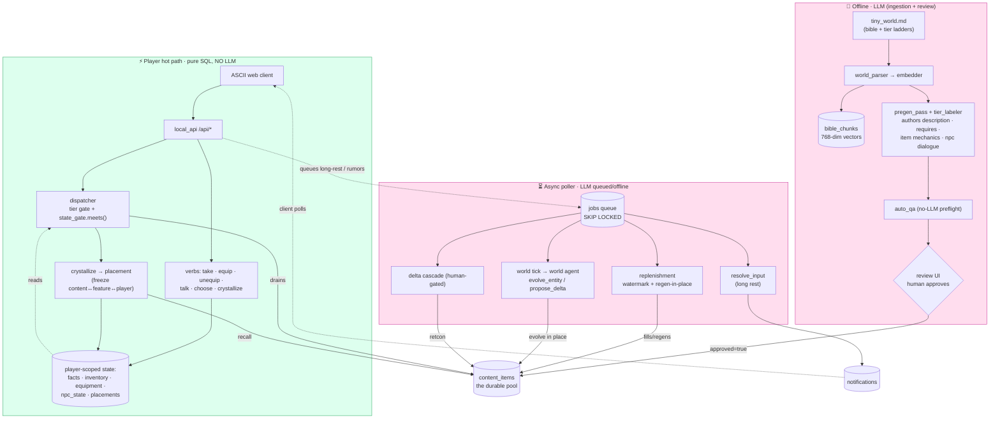

# World Engine

Procedurally-generated persistent world engine (infinite Qud-like). See `plan.md`
for the full design. This README covers the **local dev** setup only.

## How it all flows

The one rule (`CLAUDE.md`): **no LLM in the player hot path.** The diagram makes that
boundary literal — everything the LLM touches is offline (ingestion) or async (poller /
world agent); every player verb is deterministic SQL reading/writing Postgres.



Read it as three lanes: **offline** mints content (the only place creativity happens),
the **pool** is the durable hand-off, the **hot path** serves and mutates per-player
state with zero model calls, and the **async poller** does the slow LLM work (resolving
typed actions, refilling the pool, evolving the world) out of band — surfacing back to
the player only as pool refills and notifications.

## Local stack (no cloud)

| Component   | Local choice                                              | Cloud later        |
|-------------|-----------------------------------------------------------|--------------------|
| Database    | pgvector Postgres in Docker, port **5433**, own volume    | Neon               |
| Generation  | llama.cpp `llama-server` (Qwen3.6-35B-A3B) on `:8080`      | (stays local)      |
| Embeddings  | llama.cpp `llama-server` (nomic-embed-text-v1.5), `:8081`  | (stays local)      |
| API/Worker  | deferred — driven directly in Python for now              | Cloudflare Worker  |
| Letta       | existing container on `:8283`, **untouched**              | (stays local)      |

The local DB is a *separate* container (`world-engine-db`, volume
`world-engine-pgdata`) — it never touches Letta's `pgdata`.

## Setup

```bash
# 1. Database (already running if you bootstrapped). To recreate:
docker run -d --name world-engine-db \
  -e POSTGRES_PASSWORD=devpass -e POSTGRES_DB=world_engine \
  -p 5433:5432 -v world-engine-pgdata:/var/lib/postgresql/data \
  pgvector/pgvector:pg16
docker exec -i world-engine-db psql -U postgres -d world_engine < storage/schema.sql

# 2. Python env
uv venv --python 3.12
uv pip install -e .   # or: uv pip install "psycopg[binary]" python-dotenv requests fastapi uvicorn

# 3. llama.cpp servers (only needed from Step 3 onward)
#   generation:
~/code/qwen/llama.cpp/build/bin/llama-server \
  --model ~/.cache/huggingface/hub/models--unsloth--Qwen3.6-35B-A3B-MTP-GGUF/Qwen3.6-35B-A3B-UD-Q3_K_XL.gguf \
  --port 8080 --jinja --parallel 1 --no-mmap -ngl 99 --ctx-size 65536 \
  --reasoning-budget 1500
#   embeddings (own port — confirm EMBED_BASE_URL in .env matches):
llama-server --model ~/code/qwen/embed/nomic-embed-text-v1.5.Q5_K_M.gguf \
  --embedding --port 8081
```

## Progress (vs. plan.md steps)

- [x] **Step 1** — scaffold + DB connection (`storage/`)
- [x] **Step 2** — world parser (`ingestion/world_parser.py`)
- [x] **Step 3** — embedder (`ingestion/embedder.py`) — 7 chunks, 768-dim
- [x] **Step 4** — pregen pass (`ingestion/pregen_pass.py`) — runs via llama.cpp
- [x] **Step 5** — tier labeler (`ingestion/tier_labeler.py`) — `think=True`; labels against the bible's ladders: `revelation_tier`/`narrative_tier` **1-3**, `power_tier` **1-5** (clamped per-axis)
- [x] **Step 6** — review API + UI (`review/`) — FastAPI + split html/css/js; the human approval gate (approve/reject/edit pending items). Run on **:8000**; see "Review step" below
- [x] **Step 7** — dispatcher (`runtime/dispatcher.py`) — hard tier gate, tag-overlap variety
- [x] **Local API** (`runtime/local_api.py`) — worker-equivalent `/api/*` routes; substrate for tools + future CF Worker
- [x] **Step 8** — player Letta agent (`agents/`) — VALIDATED live: tool-calls reach the API, content gates correctly, reasoning stays in ReasoningMessage. Interactive REPL: `python -m agents.chat <player_id>`
- [x] **Step 10** — poller (`poller/`) — drains jobs (SKIP LOCKED), resolve_input → notification. `POLLER_STUB_LLM=1` for model-offline testing. Run: `python -m poller.poller`
- [x] **Step 11** — replenishment (`poller/replenishment.py`) — two feeds the poller drains when idle: **watermark** (per-player — `sync_pool_depth` recomputes `available` from the real dispatchable pool, so the hot path stays pure SQL; most-depleted slot tops up via llama+`auto_qa`, live with `needs_review=true`) and **regen** (global — `needs_regen` items the cascade flags after a retcon are regenerated **in place**: same `content_item` id, name kept, description rewritten, back to `active`+`needs_review`, so crystallized placements stay bound and holders get an `entity_changed` notification). `auto_qa` (`ingestion/auto_qa.py`) is the no-LLM pre-flight filter. STUB_LLM-aware. Set a `pool_depth.available` below `low_watermark` (or mark an item `needs_regen`) and the next idle tick fills it.
- [x] **Step 13** — client harness (`prototype/client.html|css|js`) — served same-origin from local API at http://localhost:8100/. ASCII map (`runtime/world_map.py`), arrow/WASD movement, walk-into / Enter to interact, long-rest + notification polling, live pool depth. No LLM in the loop.
- [x] **Crystallization / placement** (`runtime/placement.py`, table `player_placements`) — first touch of a map feature dispatches ONE pool item and freezes the binding (this thing, this place, this player); later touches recall the same item. Drains the pool through the dispatcher, so replenishment feeds it automatically. Hybrid leveling: `power_tier` advances deterministically from XP in the hot path; `revelation_tier`/`narrative_tier` are judged async by the player's Letta agent at long rest (`evaluate_progress`, deterministic fallback when llama/Letta are down) against the bible's 3-stage **Revelation/Narrative tier ladders**. Endpoints: `/api/map`, `/api/interact`, `/api/placements`, `/api/pool`, `/api/longrest`.
- [~] **Step 9** — world agent (`agents/world_agent.py`, `world_tools.py`) — singleton, bible in canonical_facts memory. Tool→API→DB path VALIDATED (drift report, resonance, delta proposal w/ human gate, reviewer flag). Agent *conversation* needs llama: `python -m agents.world_agent`
- [x] **Step 14** — world delta cascade (`poller/cascade.py`) — VALIDATED e2e (stub): approve → 4-layer ripple (bible version → vector → pool triage → agent memory + retcons). Trigger: `POST /api/delta/{id}/approve`.
- [ ] Step 12 — pending (Cloudflare Worker — port of local API, do when going online)

World-agent API: `/api/drift`, `/api/drift/{id}/resonance`, `/api/delta`, `/api/delta/{id}/{flag,approve}`.

## End-to-end
`python -m prototype.seed_run` runs the full offline pipeline from scratch
(parse → embed → pregen → tier-label → approve → sample dispatch). Needs llama.

**Watch the whole loop:** `python -m prototype.full_demo [--show-llm] [--stub]`
walks player-entry → long-rest → drift-clustering → world-agent → cascade → retcon
in one run. Auto-detects llama (stubs if offline); `--show-llm` prints the Qwen
prompts/responses and the world agent's reasoning/tool trace. Needs the local API
on :8100 and **no** separate poller running (the demo drives the poller in-process).

Drift accumulates for real: `/api/rumor` queues a `cluster_drift` job; the poller
merges each rumor into the nearest existing cluster by pg_trgm trigram similarity
(≥0.30) — incrementing player_count — or starts a new one. No LLM.

### Run the whole system
Processes (each its own terminal; llama optional — use stubs without it):
```
# 1. data + model
docker start world-engine-db                 # Postgres+pgvector :5433
llama-server ... --port 8080 --jinja         # gen   (optional; stub otherwise)
llama-server ... --embedding --port 8081     # embed (optional)
#    Letta container already runs on :8283

# 2. seed a world (once; needs llama)
python -m prototype.seed_run --full          # or skip if pool already seeded

# 3. services
uvicorn runtime.local_api:app --host 0.0.0.0 --port 8100   # API + game client
POLLER_STUB_LLM=1 python -m poller.poller                  # drop the env var when llama is up
```

The full loop, no LLM in the player path:
1. **Play** — open http://localhost:8100/ : walk the map, crystallize features (instant SQL dispatch + XP power-ups), spread rumors, take a long rest.
2. **Long rest resolves** — poller drains the `evaluate_progress`/`resolve_input` job → notification (revelation/narrative may deepen) appears in the client.
3. **World drifts** — players' rumors accumulate in collective_drift.
4. **World agent** — the poller's **world tick** auto-invokes it once drift crosses the threshold (or run `python -m agents.world_agent` manually); it reviews drift and proposes a delta (human-gated). See "World tick" below.
5. **Approve** — `POST /api/delta/{id}/approve` → cascade job → bible version bumps, pool triaged, players retconned.
6. **Players notified** — retcon notifications surface in the client.

### The play layer — map + crystallization

The player-facing surface is an ASCII map, not a button panel. Geometry is shared
and static (`runtime/world_map.py`: 31×15 — three upper rooms (med bay · storage · crew
quarters) over a corridor, three lower rooms (reactor · sealed lab · observation), 21 features);
*identity* is per-player and persistent.

- **Crystallization** (`runtime/placement.py`, table `player_placements`). A map
  feature (`feature_key`) is anonymous terrain until first touch. On first touch we
  `dispatch` ONE pool item of the feature's type at the player's tier and freeze the
  binding `(player_id, feature_key) → content_item_id`; every later touch recalls
  the **same** item. First touch goes through the dispatcher, so it marks the item
  seen and drains the pool — which is what makes the watermark replenishment feed
  refill behind the player with no extra wiring. A feature whose pool is dry at the
  player's tier returns `status:"withheld"` and stays uncrystallized until a tier
  unlock. Still pure hot path: no LLM.
- **Hybrid leveling.** `power_tier` advances **deterministically in the hot path**
  from XP (thresholds `[0,30,80,150,250]`; XP per crystallization scales with the
  item's revelation tier). `revelation_tier`/`narrative_tier` are **judged async at
  long rest**: `/api/longrest` queues an `evaluate_progress` job; when llama+Letta
  are up the player's own Letta agent decides (`player_agent.evaluate_progress`,
  which quotes the live ladders into the prompt and lets the agent advance each axis
  via `increment_revelation_tier` / `increment_narrative_tier`), otherwise a
  deterministic fallback in `poller/job_handlers.py` advances both axes against
  crystallization counts. Either way it's judged against the bible's **3-stage
  Revelation + Narrative ladders**, independently per axis.
- **Endpoints:** `/api/map`, `/api/interact`, `/api/placements`, `/api/pool`,
  `/api/longrest` (plus the existing `/api/state`, `/api/input`, `/api/rumor`,
  `/api/notifications`).

Client controls: arrows / WASD to move, walk into a thing or **Enter** to interact,
**R** to long rest. A rest box queues a freeform action (`/api/input`); a rumor box
spreads a belief (`/api/rumor`) into collective drift.

**Multi-player:** the player id lives in the URL (`?player=…`), so **each browser
tab is a different player**. The player bar switches ids (with quick-switch chips
remembered in localStorage); open two tabs to submit rumors as different players and
watch drift cluster across them.

### Content types

Six types live in `content_items`; the pregen prompt (`ingestion/pregen_pass.py`)
disambiguates them for the generator, the dispatcher serves them, and the map
crystallizes most of them onto features.

| Type | What it is | Surfaces as | Ladder it feeds |
|------|------------|-------------|-----------------|
| `npc` | Someone you can **talk** to (humanoid/AI) — personality, conversation. In the full design gets a per-NPC relationship agent on real interaction. | `N` map features | — |
| `creature` | Something you **can't** talk to — lives on the station, mobile, reacts rather than converses (harmless → dangerous). | `c` map features | — |
| `item` | A physical object you examine or carry; its description teaches worldbuilding, not stats. | shelves/tables (`S T s`) | power (gating) |
| `lore_fragment` | Recorded **fact / evidence** — a log, manifest, inscription, journal page. The player *reads* it. The **main carrier of the mystery**: surface fragments mundane, deep ones reveal the level below / the Quiet. | consoles/terminals/doors (`= +`) | **revelation** |
| `rumor` | **Hearsay** — uncertain, deniable, "they say…", no proof. Pool rumors are spoken hearsay; player-spread rumors (`/api/rumor`) feed `collective_drift` → the world agent may canonize them. | *not on the map yet* (see note) | the **emergent-canon** loop |
| `plot_beat` | A narrative **event** you witness or trigger — written as an unfolding scene, not an object (a confrontation, a discovery, a faction's behavior shifting). | story triggers (the hatch `?`) | **narrative** |

The distinctions the generator most often blurs (now spelled out in the prompt):
**`lore_fragment` = found document (proof)** vs **`rumor` = hearsay (no proof)**, and
**`item` = static object** vs **`plot_beat` = unfolding event**.

`dialogue` is a seventh, *system-generated* type (not pregen'd): long-rest input
resolutions land as `dialogue` items (`poller/job_handlers.py`).

**Note — rumors aren't placed in-world yet.** Only `npc/creature/item/lore_fragment/
plot_beat` map to features in `runtime/world_map.py`. Pool `rumor` items are generated
for the drift/world-agent side but have no map feature, so a player can't *encounter*
one in-game today — wiring a rumor source (an NPC passing one on, or a notice board)
is a small future addition.

### Review step (the human approval gate)

Pregen writes items as `approved=false` — **nothing reaches players until a human
approves it.** This is the one explicit gate; content minted later by replenishment /
long-rest skips it (goes live `approved=true, needs_review=true`) and is spot-checked
retroactively. `review/review_api.py` is a small *separate* FastAPI app + UI for
that pass: a list of pending items on the left, the selected item's card on the right.

```bash
uvicorn review.review_api:app --port 8000 --reload    # NB: port 8000, not the game's 8100
# open http://localhost:8000/
```

Pick any item from the list (type · name · revelation tier) to load its card — type,
the three tiers, name, description, tags, world_refs, the `requires` gate, and the raw
`content` JSON (editable). Approve/Reject remove it from the list and auto-advance to
the next.

**Tree-shaped view for dialogue + gates.** When the selected item is an NPC with a
`dialogue` tree, the card renders it as a navigable graph instead of raw JSON: each
node with its line and the start node marked, every choice showing what it *needs*
(the gate — `standing≥1`, `item:keycard`, facts/rep) and what it *does* (effects —
`set flag…`, `standing +1`, `gives…`, `END`) and its `→ goto` target. The validators
run live (`GET /validate/{id}`): the exhaustive dialogue checker and the pool-wide gate
reachability analysis, with defects shown as a summary banner *and* badged inline on
the offending node/choice (a broken goto, a stuck node, a dead branch, an orphaned
gate). So a reviewer validates conversation flow and requirements by looking, not by
tracing JSON. No LLM — all static analysis.

**Handling orphaned gates** (a gate that can never open — it needs state nothing in the
pool produces). Three admin moves, each supported in the UI:
- **Triage** — a pool-wide *reachability dashboard* in the left pane (`GET /reachability`)
  lists every orphan grouped by consuming item; click one to load its card.
- **Loosen** — each orphan issue has a one-click **loosen** button that drops the
  offending clause from the item's `requires` (the gate column is editable in the card,
  via `POST /edit`), making the content reachable.
- **Author a producer** — the card's *produces* line shows what an item yields, so you
  can see what to add elsewhere to satisfy the gate intentionally instead of removing it.

`produces` is **computed, not a stored field** — there's no `"produces"` key in the
JSON. It's the inverse of `requires` (a gate *consumes* state; `produces` is what an
item *writes*), derived in `runtime/gate_reachability.py::item_produces` and returned by
`GET /validate/{id}`:
- an **NPC** yields whatever its *reachable* dialogue choices' `effects` do —
  `set_facts` → `sets flag.x`, positive `adjust_rep` → `+rep keepers`, `set_npc_flags`
  → `npc:asked`, `give_items` → `gives item`;
- an **item** yields its take-tokens — its lowercased `name` plus `tags` (what
  `requires.items` matches, since taking it drops those into inventory);
- other types (creature/lore/rumor/plot_beat) produce nothing, so the line is hidden.

A note on `min_rep`: reputation defaults to 0, so a `min_rep` clause with threshold ≤ 0
is satisfied by default and is **not** treated as an orphan (it only excludes players
who've gone *negative* with a faction); only thresholds > 0 need a producer.

The pending list has an in-memory **search box** (filters by name / type / tags,
case-insensitive substring) — no backend round-trip, just narrows what's shown.
Per-card actions:
- **Approve** → `approved=true, approved_at=now()`, now dispatchable. If you edited the
  JSON box first, your changes are merged into `content` before approval.
- **Reject** → `status='retired'` (kept in the table, never dispatched again).
- **Skip** → send it to the back of the queue for later.

A `needs_review` badge flags items that went live un-gated (replenishment / long-rest)
and are here only for a retroactive look. The header chips come from `/stats`.

Endpoints (all no-LLM, same-origin): `GET /pending?limit=`, `POST /approve/{id}`
(optional body `{"edits": {...}}`), `POST /reject/{id}`, `GET /stats` (per-type
pending / approved / retired counts).

**Heads-up:** `seed_run` auto-approves at the end (step 6 calls `approve_all`), so a
plain `--full --fresh` reseed leaves **0 pending** — the review UI shows an empty
pool. To actually do the review pass, seed with **`--no-approve`** so items stay
`approved=false`:

```bash
python -m prototype.seed_run --full --fresh --no-approve   # pregen + tier-label, NO auto-approve
uvicorn review.review_api:app --port 8000                  # then curate at :8000
```

`python -m scripts.approve_all` is the bulk-approve shortcut (what step 6 calls) when
you'd rather rubber-stamp the whole pool than curate it.

### Play it
1. `uvicorn runtime.local_api:app --port 8100` (serves the client + API)
2. `POLLER_STUB_LLM=1 python -m poller.poller` (resolves long-rests + drives replenishment; drop the env var when llama is up for real generation)
3. open **http://localhost:8100/** — and a second tab at `http://localhost:8100/?player=someoneelse`

### Full end-to-end acid test (real content, poller live)

Five terminals. Backend logging is on by default (`world.*` loggers → stdout; set
`WORLD_LOG_LEVEL=DEBUG` for more). Needs both llama servers up.

```bash
# T1 — generation model
~/code/qwen/llama.cpp/build/bin/llama-server --model …Qwen3.6… --port 8080 --jinja …
# T2 — embedding model
llama-server --model …nomic-embed-text… --embedding --port 8081

# T3 — wipe + reseed from scratch, then re-seed the world agent off the new bible
python -m scripts.reset_world --players --agents --yes     # nuke pool fallout + players + their agents
LLM_SKIP_THINKING=1 python -m prototype.seed_run --full --fresh   # parse→embed→pregen→label→approve (slow; many llama calls)
python -m agents.world_agent --recreate                    # world agent snapshots the new bible

# T4 — API (watch the request + dispatch + crystallize log stream here)
uvicorn runtime.local_api:app --host 0.0.0.0 --port 8100

# T5 — poller, llama-live (watch jobs + replenishment + leveling here)
python -m poller.poller
```

Then open **http://localhost:8100/** (and a 2nd tab `?player=other`) and play:
walk + crystallize (T4 logs `FIRST TOUCH`/`CRYSTALLIZE`/`RECALL`/`WITHHELD` + XP
power-ups), spread the same rumor as both players (T5 logs `drift MATCHED`), long
rest (T5 logs `evaluate_progress` → the player agent's revelation/narrative call),
and keep crystallizing until a pool runs low (T5 logs `watermark LOW` → `replenished
… llama`). `POLLER_STUB_LLM=1` on T5 makes it all run with llama offline (filler
content), if you just want to exercise the mechanics.

### Housekeeping scripts
- `python -m scripts.approve_all` — bulk-approve pending items (prototype seeding).
- `python -m scripts.reset_world` — reset to pristine "just the pool": removes
  generated content (`needs_review=true`) + all player-action fallout (drift,
  deltas, notifications, jobs, telemetry, placements, watermarks) and resets players
  in place. `--players` deletes player rows; `--agents` also deletes the per-player
  `player_*` Letta agents (needs Letta up; leaves the world agent); `--yes` skips the
  prompt. The original human-approved pool (`needs_review=false`), the bible/chunks,
  and the world agent are preserved — nothing to regenerate after a reset.
- `python -m scripts.add_tier_ladders` — insert the revelation/narrative/power tier
  ladders into the bible (idempotent; embeds on first insert only).
- `python -m scripts.reembed_bible [--all]` — backfill embeddings for bible chunks
  (use after adding ladders/sections while the embed server was down).
- `python -m scripts.export_site` — snapshot the story bible + entire content pool
  as a single self-contained HTML file (`world_export.html` by default). No server
  needed; open in any browser or share directly. The bible renders as collapsible
  sections; items are filterable by type and searchable. Options:
  `--out path/to/file.html`, `--bible ingestion/chapter1_bible.md`.

Backlog: automated content dedup pass (human review can't scale) — see memory.

### Regenerating content & agents

The pool is durable canon; players and their crystallizations are reproducible. To
rebuild the pool **against the current ladders** (e.g. so content actually spans the
3 revelation/narrative stages):

```bash
python -m prototype.seed_run --full --fresh   # needs llama up (:8080 gen, :8081 embed)
```
`--fresh` wipes the existing pool + per-player crystallizations first, then
parse→insert→embed→pregen→tier-label→approve from `prototype/tiny_world.md` (which
carries the ladders). Generation + labeling are ladder-aware (1-3 rev/nar, 1-5 pow).

To **top up** the pool without wiping anything (append-only), generate N more of one type:
```bash
python -m scripts.generate --type npc --count 10            # lands pending for review
python -m scripts.generate --type lore_fragment --count 20 --approve   # live immediately
```
Runs pregen→QA→normalize→tier-label for just that type; needs llama. See
`docs/content-authoring-plan.md` for the planned authoring UI + anti-orphan generation.

**Do the Letta agents need regenerating?**
- **Player agents — no, they self-heal.** The leveling prompt quotes the *live*
  ladders each run, and `get_or_create_player_agent` re-attaches any tools added
  since the agent was created (`sync_player_tools` — e.g. `increment_narrative_tier`),
  so reused agents stay current without a manual rebuild. The agent judges **both**
  ladders at long rest and advances each independently via `increment_revelation_tier`
  / `increment_narrative_tier`. (`reset_world` keeps `letta_agent_id`; `--players`
  drops it and a fresh agent is created on next contact.)
- **World agent — only after a fresh content/bible regen.** It snapshots the bible
  into `canonical_facts` at creation, so a new bible leaves it stale. Re-seed it:
  `python -m agents.world_agent --recreate`. (During normal play the Step-14 cascade
  already updates its memory on each approved delta.)

### Letta agent layer (adapted from ~/code/letta/hoopybot)
- `agents/letta_client.py` — Letta config (llama.cpp via host.docker.internal, 768-dim embed, ctx=65536), tool upsert, sandbox env injection, send/clear.
- `agents/player_tools.py` — self-contained stdlib-urllib tools calling the local API.
- `agents/player_agent.py` — create / get_or_create player agent (id persisted on player_state); `evaluate_progress()` is the long-rest leveling judge (quotes live ladders, lets the agent call `increment_revelation_tier`).
- `agents/world_agent.py` — singleton; `--recreate` re-seeds it from the current bible after a regen; `run_world_review()` is the drift-review turn the world tick drives.

### World tick (automatic drift review)

Nothing in the engine *loops* except the poller — agents are invoked, not autonomous.
The player agent fires on long-rest jobs automatically; the **world agent** is driven
by the poller's **world tick** (`poller/world_tick.py`, called on idle ticks):

- **Gated** so it doesn't hammer llama or re-propose the same belief:
  - time — at most once per `WORLD_TICK_INTERVAL` seconds (default 180),
  - threshold — only `collective_drift` clusters with `player_count >= WORLD_TICK_THRESHOLD`
    (default 2) that are still `accumulating`,
  - novelty — a cluster is re-reviewed only if its `player_count` grew since last time,
  - llama — skipped (with a warning) if the generation model is down.
- When it fires, `run_world_review()` sends the world agent a review turn **with
  reasoning on** (`no_think=False` — `/no_think` makes the reasoning model skip its
  tool calls). The agent reads drift via `get_drift_report`, and if a belief genuinely
  resonates and fits canon, proposes **one** delta and flags it for human review.
  **Proposals never change canon directly** — they land in the reviewer queue for
  `POST /api/delta/{id}/approve`, which kicks off the cascade.

For solo testing, lower the bar so it fires on your own rumors:
```bash
WORLD_TICK_THRESHOLD=1 WORLD_TICK_INTERVAL=60 python -m poller.poller
```
The `world.worldtick` logger shows each tick: which clusters qualified, and whether
the agent proposed or judged it noise (e.g. a one-player rumor about a non-canon
character is correctly declined).

**Two levels of world change.** Most of the world lives in `content_items`, not the
bible, so the agent can evolve a *specific entity* without rewriting canon:
- **Entity-level** (drift about a specific npc/item/place): the agent calls
  `lookup_entities(query)` to resolve the subject to its `content_item`, then
  `evolve_entity(id, change_kind, ...)` — `enrich` (append), `regen` (replace
  description), or `retire`. Applied **immediately, flagged needs_review**, **in
  place (same id)** so crystallized placements stay valid. The API stays dumb — the
  agent authors the new text. Endpoints: `GET /api/entities`, `POST /api/entity/{id}/evolve`.
- **Bible-level** (factions / station / the mystery): still `propose_bible_delta` →
  human-gated cascade.

Passing `drift_id` to `evolve_entity` marks that cluster `canonized` so it stops
resurfacing. After changing the agent's prompt/tools, **`python -m agents.world_agent
--recreate`** (Letta doesn't reload the system prompt; new tools need attaching).

**"The world changed while you slept."** When an entity is evolved, every player who
has it *crystallized* (a placement points at it) gets an `entity_changed` notification
carrying the diff — the appended sentence for `enrich`, `before`/`after` for `regen`.
The client's notification poll renders it as a headline (the agent's summary) + a
"what's new" reveal, and refreshes placements so the next interaction shows the new
text. Players who never met the entity aren't spammed — they just meet the current
version. (`_notify_entity_change` in `runtime/local_api.py`.)

**To test Step 8 live:** start both llama servers (:8080 gen, :8081 embed), run the
local API bound for Docker access — `uvicorn runtime.local_api:app --host 0.0.0.0 --port 8100`
— then `.venv/bin/python -m agents.player_agent letta_demo`.

Tier policy (implemented — see "The play layer"): `power_tier` (1-5) advances
deterministically from XP in the hot path; `revelation_tier` & `narrative_tier`
(1-3, the bible ladders) are evaluated async at long rest by the player agent (or a
deterministic fallback), surfaced via notifications. The dispatcher just reads
current tiers and enforces the hard gate on all three axes.

LLM calls default to **no_think** (`lib/llm.call_llm(..., think=False)`); pass
`think=True` per-call where deliberation helps (tier labeling, cascade triage).

TODO: replace the cheap frequency/proper-noun tag heuristic in `world_parser.py`
with an LLM tag-extraction pass when quality matters.

### Embeddings (the semantic layer)

The bible is chunked per section into `bible_chunks` with a 768-dim
nomic-embed-text vector (`ingestion/embedder.py`). What they're **for**:

- **Semantic scene matching in dispatch.** `dispatcher._relevant_tags` embeds the
  player's current scene, finds the nearest bible sections by cosine distance, and
  biases content selection toward their tags (`dispatch(..., use_semantic=True)`).
  Off by default in the prototype — exact tag-overlap is enough for a small,
  hand-tagged world. It earns its keep **at scale**: with thousands of items and a
  large bible you can't hand-tag everything, so meaning-based retrieval surfaces
  contextually-right content even without exact tag matches.
- **World-delta cascade.** A canon change carries `invalidates_tags` /
  `enriches_tags`; vector similarity (`reembed_affected_chunks`) finds which chunks
  and content the change ripples into, so retcons hit the right material.
- **Grounding generation.** Retrieve the relevant canon for a new item so pregen /
  replenishment stay consistent with the world (and, later, drift dedup by meaning).

The 3-stage revelation/narrative ladders live in the bible too, so they're chunked
and embedded like any other section. Ops:

```bash
python -m scripts.reembed_bible          # backfill any NULL-embedding chunks (embed server up)
python -m scripts.reembed_bible --all    # force re-embed every chunk
```

`reset_world.py` leaves the bible/chunks untouched, so embeddings survive a reset;
`scripts.add_tier_ladders` only embeds on first insert (it no-ops if the ladders
already exist), so use `reembed_bible` to fill embeddings added while offline.

## Gameplay engine (player-scoped state + verbs)

The "doing-stuff" engine — see `docs/gameplay-engine-plan.md` for the full design.
The spine: **player-scoped state + a generic `requires` gate**. The hard tier gate is
just the prefilter; `runtime/state_gate.meets(player_id, requires)` is the reactive
layer ("how the world reacts to YOU"), consulted by the dispatcher and dialogue.
`requires` shape: `{"facts": {...}, "items": [...], "min_rep": {...}}` (empty = always
available, so existing content is unaffected until gated). **No LLM in any of it.**

Built (backend + client + tests):
- **State** — `player_facts` (flags/counters/reputation); `runtime/state_gate.py`; `GET/POST /api/facts`.
- **Inventory & equipment** — `runtime/inventory.py`, `equipment.py`; items carry `content.mechanics={slot,stats}`; `GET /api/inventory`, `POST /api/item/{feature}/take`, `/api/equip`, `/api/unequip`. Taking an item satisfies `requires.items`.
- **Dialogue + NPC relationships** — `runtime/dialogue.py`; NPCs carry an inline `content.dialogue` tree; per-(player,NPC) `player_npc_state` (standing/flags/node); `GET /api/npc/{id}/talk`, `POST /api/npc/{id}/choose`. Choices gate on `requires` + npc `min_standing`/`npc_flags`; effects write facts/rep/standing/items.
- **Generation fills the gates** — pregen authors `requires`, item `mechanics`, npc `dialogue` (`ingestion/pregen_pass.py`); `storage.insert_content_item` persists them.
- **Client** — the player surface exposes the verbs: `t` takes an item; touching an NPC opens a dialogue panel (line + only the choices you currently `meet`, choices unlock as standing/rep/items change); a gear panel shows derived stats + equipment + inventory (equip/unequip/drop); a facts panel shows the flags/reputation the gate reads. `POST /api/item/drop` is the only added route.

Deferred: **combat** (`mechanics` schema reserved) and player-agent memory-block sync.

## Tests

`pytest` suite in `tests/` — runs against the local DB with the LLM stubbed
(`POLLER_STUB_LLM=1`, set in `conftest.py`), so **no llama needed**. Tests isolate
via throwaway player ids / content items (synthetic feature types where dispatch
needs to be deterministic) and clean up on teardown — they leave no rows behind. The
shared fixtures (`tests/conftest.py`) are `new_player`, `make_content`, and `place`.

```bash
uv pip install -e ".[dev]"   # pytest + hypothesis
.venv/bin/python -m pytest    # 80 tests, ~55s (the stateful machine dominates)
```

Covers: dispatch hard tier-gate (all three axes), crystallize→recall stability +
withhold-when-dry, XP/power thresholds, drift clustering (pg_trgm match vs new),
deterministic long-rest progress, entity evolve-in-place + holder notification +
fuzzy lookup, dedupe (normalized-name merge + placement re-point), watermark dialogue
exclusion, and pure units (map geometry, tier clamps, parser, generator parsing).
Gameplay-engine coverage: `state_gate.meets` truth table; facts/reputation; the gate
hiding/showing dispatched content; inventory take + item-gating (by name and tag);
equip stats, slot-swap, unequip/drop cascade; and dialogue gating on
standing / reputation / held-item / npc-flags with effect application.

### The playtester (plays the game over the API)

`scripts/playtester.py` is a **bot that drives the real FastAPI app end-to-end** (via
`TestClient` → local Postgres) and asserts the world reacts correctly. Unlike the unit
tests — which call runtime functions directly — it exercises the full HTTP + runtime
stack through the actual verbs, so it's the integration safety net for the
"doing-stuff" engine. It self-seeds an isolated world (a throwaway player + content
with item mechanics and an NPC whose deeper dialogue choices are gated on standing and
on a carried item), plays it, and scrubs everything on exit. No LLM.

```bash
# scripted scenario (12 assertions: take → equip → stat change, gated dialogue unlocks)
.venv/bin/python -m scripts.playtester
# seeded random "monkey": fires random VALID actions, checks invariants hold
.venv/bin/python -m scripts.playtester --random --seed 7 --steps 200
.venv/bin/python -m scripts.playtester --random -q     # quiet: failures + summary only
```

- **Scripted mode** walks a fixed reactive scenario and asserts each step (item enters
  inventory; equipping raises atk by the item's stats; a standing-gated choice is hidden
  at standing 0 then appears after a `+standing` choice; unequip restores baseline).
- **Random / monkey mode** (`--random`) seeds a `random.Random(seed)` and fires random
  *valid* actions (take / equip / unequip / talk+choose / read facts) for `--steps`
  turns. It's deterministic per seed and asserts invariants rather than exact values:
  no action raises, and **equipped items always still exist in inventory** (catches
  dangling-FK / cascade regressions a scripted path wouldn't hit).
- **Clean by construction.** Cleanup is idempotent and runs from both a `finally` block
  and a **SIGINT/SIGTERM trap**, so even a `Ctrl-C` or `kill` mid-run leaves zero rows
  behind — never dirty test state. Exit code is nonzero on any failed assertion, so it
  slots into CI next to pytest.

Both modes are also enforced as pytest integration tests (`tests/test_playtester.py`),
so a verb regression fails the suite and the self-cleanup is exercised on every run.

### QA tooling for gates & dialogue trees

Three checkers attack the "managing all the requirements and dialogue trees" problem —
all deterministic, read-only, no LLM, and usable as nonzero-exit CI gates:

- **Model-based stateful test** (`tests/test_stateful.py`, Hypothesis). Keeps a full
  reference model of player state beside the live API; every generated action
  (take/equip/unequip/talk+choose) is applied to both and asserted to agree, over long
  sequences, with automatic **shrinking** of any failure to a minimal reproducer. Key
  invariants: derived stats equal the power-tier baseline plus the equipped items'
  stats; equipped items are always present in inventory; and `talk()`'s visible choices
  exactly match what the model predicts the gate should show.

- **Exhaustive dialogue-tree validator** (`runtime/dialogue_validate.py`;
  `python -m scripts.validate_dialogue [--all]`). A dialogue tree is a finite state
  machine over `(node, standing, npc_flags)`, so it's checkable to completion: it walks
  the whole reachable state space and reports broken `goto`s, unreachable nodes, stuck
  nodes (reachable but no way to leave), and choices whose standing/flag gate can never
  open. (Found 4 real stuck-node defects in the seeded pool.)

- **Pool-wide gate reachability** (`runtime/gate_reachability.py`;
  `python -m scripts.validate_gates [--all]`). Proves every gated content_item is
  reachable by *some* player path: a fixpoint closure over the producer→consumer graph
  (dialogue effects / take / give_items produce facts/items/rep; `requires` blobs
  consume them). Flags **orphans** (nothing in the pool produces the required state — a
  typo'd flag, a missing item) as errors and producer-behind-a-dead-gate as warnings.
  Models only the deterministic state — `revelation`/`narrative` tier gates are assumed
  satisfiable because the Letta agent, not static rules, advances them (you can't
  model-check past an LLM oracle). (Found 7 real orphaned gates in the seeded pool,
  including a generator bug using `flag:` instead of the `flag.` convention.)

## Verify

```bash
.venv/bin/python -c "from storage.content_store import get_conn; print(get_conn())"  # Step 1
.venv/bin/python -m ingestion.world_parser                                          # Step 2
.venv/bin/python -m lib.llm                                                          # llama health
.venv/bin/python -m ingestion.embedder                                              # Step 3
```
