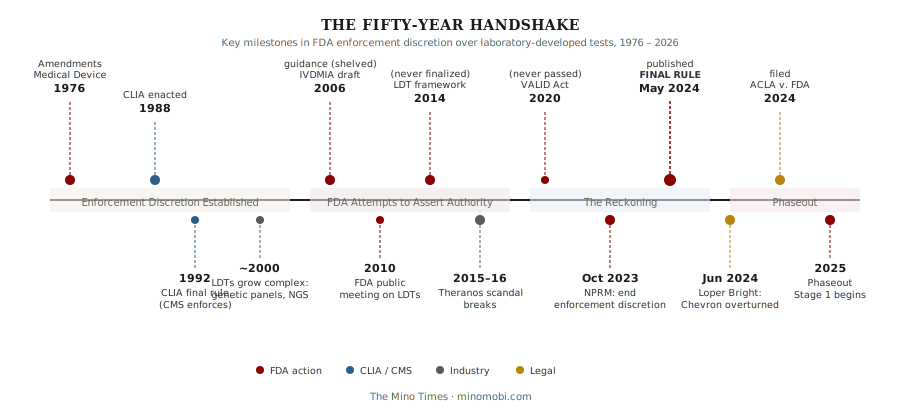
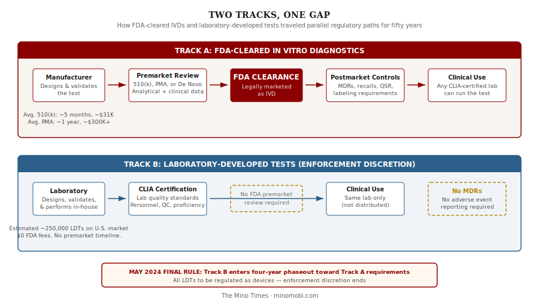

For nearly half a century, the most consequential agreement in American clinical diagnostics was never written down. It had no statutory text, no formal regulation, no signature page. It was a posture — the [Food and Drug Administration](https://www.fda.gov/) choosing, year after year, not to exercise authority it claimed to possess. The agency called it "enforcement discretion." The laboratory industry called it freedom. The patients whose care depended on the tests produced under this arrangement were never asked what to call it.

In May 2024, FDA tried to end it. The agency [published a final rule](https://www.fda.gov/medical-devices/in-vitro-diagnostics/laboratory-developed-tests) initiating a four-year phaseout of enforcement discretion over laboratory-developed tests. Ten months later, a [federal judge in Texas vacated the rule in its entirety](https://documents.cap.org/documents/ldt-courtruling-03-31-2025.pdf), holding that LDTs are not "devices" under the statute and never were. FDA did not appeal. In September 2025, the agency formally rescinded the rule. The handshake survived.

This is Part 1 of *The LDT Reckoning*, a five-part series examining the regulatory gap at the center of American diagnostics. The final rule is dead, but the problem it tried to solve is not. Before the courtroom arguments, the compliance cost models, and the orphan tests caught in the crossfire, there is a story about how two federal agencies divided a regulatory domain and left a gap that grew for fifty years until something almost broke.

## The Origin of the Handshake

In 1976, Congress passed the [Medical Device Amendments](https://www.fda.gov/about-fda/fda-history-exhibits/milestones-us-food-and-drug-law-history) to the Federal Food, Drug, and Cosmetic Act. The law gave FDA authority to regulate medical devices, including in vitro diagnostics — the reagents, instruments, and test systems used to examine specimens taken from the human body. An IVD kit manufactured by Abbott or Roche and sold to hospitals across the country was, under the new law, a medical device subject to premarket review.

But there was another category. Clinical laboratories had always made some of their own tests. A pathologist at an academic medical center might prepare a reagent, validate a staining protocol, or combine commercially available components into an assay tailored to a specific patient population. These were "home brew" tests — designed, manufactured, and used within a single laboratory, by the personnel of that laboratory, for patients of that laboratory. They were not distributed. They were not sold. They were, in a meaningful sense, an extension of the practice of medicine.

FDA had statutory authority to regulate these tests as devices. It chose not to. The tests were low-volume, low-complexity, and confined to institutions where board-certified pathologists supervised every step. The agency had other priorities — the IVD manufacturers distributing millions of test kits nationwide posed a more immediate public health concern than a university hospital's in-house autoimmune panel. And so the handshake began: FDA would look the other way, and laboratories would self-regulate.

## The CLIA Layer

The handshake might have remained a footnote had it not been reinforced twelve years later. In 1988, Congress passed the [Clinical Laboratory Improvement Amendments](https://www.cms.gov/medicare/quality/clinical-laboratory-improvement-amendments), known as CLIA, giving the Centers for Medicare & Medicaid Services authority to regulate clinical laboratories. CLIA established standards for laboratory quality: personnel qualifications, quality control procedures, proficiency testing, and inspection requirements. Any lab that tested human specimens for health assessment had to be CLIA-certified.

This created a structural distinction that would echo for decades. CMS, through CLIA, regulated the *laboratory*. FDA, through the device authorities, regulated the *test*. For commercially manufactured IVDs, both layers applied — the test went through FDA premarket review, and the lab running it had to meet CLIA standards. For laboratory-developed tests, only the CLIA layer existed. The lab was inspected. The test was not.

The distinction seems technical. It is not. CLIA asks whether a laboratory follows good practices: Are the technicians qualified? Are the instruments calibrated? Are the controls run? It does not ask whether the test itself is valid — whether the assay actually measures what it claims to measure, with what sensitivity, at what specificity, across what patient populations. That is the question FDA premarket review is designed to answer. For LDTs, no one was asking it.

## The Transformation

For the first two decades, the gap was small because the tests were small. A home-brew test in 1985 might be a single-analyte immunoassay run on a dozen patients a month. The pathologist who designed it understood its limitations. The clinicians who ordered it worked down the hall.

Then the gap became a chasm.

Three forces converged in the late 1990s and early 2000s. First, molecular biology transformed what a laboratory test could do. Polymerase chain reaction gave way to real-time PCR, then multiplex panels, then next-generation sequencing. A "laboratory-developed test" was no longer a pathologist mixing reagents — it was a computational pipeline processing gigabytes of genomic data through proprietary algorithms. Second, the market grew. Reference laboratories like [Quest Diagnostics](https://www.questdiagnostics.com/) and [Laboratory Corporation of America](https://www.labcorp.com/) began offering LDTs not just to their own patients but to ordering physicians nationwide, blurring the line between a test "used within a single laboratory" and a test that was functionally distributed. Third, clinical stakes escalated. LDTs moved from the periphery of care into the center: companion diagnostics guiding cancer therapy, prenatal screening panels informing reproductive decisions, pharmacogenomic assays determining drug dosing.

By the 2010s, an estimated 250,000 LDTs were in clinical use across the United States. Some were simple modifications of FDA-cleared kits. Others were entirely novel assays with no predicate, no published validation data, and no adverse event reporting requirements. All of them operated in the space the handshake had created: CLIA-certified laboratories running tests that had never been through premarket review.

## The Failed Assertions

FDA tried to close the gap. It tried repeatedly. It failed every time.

In 2006, the agency issued [draft guidance on IVDMIAs](https://www.fda.gov/medical-devices/in-vitro-diagnostics/in-vitro-diagnostic-multivariate-index-assays) — in vitro diagnostic multivariate index assays, the algorithmic tests that combined multiple biomarkers into a single clinical score. The guidance proposed treating these complex LDTs as devices requiring premarket review. The laboratory lobby pushed back. Congressional allies intervened. The guidance was shelved.

In 2010, FDA held a two-day [public meeting](https://www.federalregister.gov/documents/2010/06/14/2010-14191/public-meeting-on-oversight-of-laboratory-developed-tests) on LDT oversight, signaling intent to develop a broader regulatory framework. Comments flooded in — overwhelmingly opposed from the laboratory industry, cautiously supportive from patient safety advocates. The meeting produced no rule.

In 2014, the agency published a [framework document](https://www.fda.gov/medical-devices/in-vitro-diagnostics/framework-regulatory-oversight-laboratory-developed-tests) proposing risk-based oversight of LDTs. High-risk tests would be regulated first; low-risk tests would remain under enforcement discretion. The framework was never finalized. The Obama administration, facing industry opposition and competing priorities, let it lapse. The Trump administration's 2017 discussion draft met the same fate.

Congress tried too. The [VALID Act](https://www.congress.gov/bill/118th-congress/house-bill/2369) — the Verifying Accurate Leading-edge IVCT Development Act — was introduced in 2020 with bipartisan sponsorship from Representatives Larry Bucshon (R-IN) and Diana DeGette (D-CO). It proposed a new regulatory category, "in vitro clinical tests," with risk-tiered oversight that would apply to both manufactured IVDs and LDTs. The bill was reintroduced in 2021 and again in 2023. It never passed. The laboratory lobby was too entrenched, the IVD manufacturers were ambivalent, and Congress had no appetite for a regulatory fight with no obvious crisis to drive it.

The pattern was consistent: FDA would assert interest, the industry would resist, Congress would decline to act, and the handshake would continue. The agency lacked not the authority but the political will. Or rather, the political environment lacked the catalyst.

## The Theranos Inflection

The catalyst arrived in 2015, wearing a black turtleneck.

[Theranos](https://en.wikipedia.org/wiki/Theranos) was not, strictly speaking, an LDT story. Elizabeth Holmes's company claimed to have developed proprietary diagnostic technology — the "Edison" device — that could run hundreds of tests from a single drop of blood. The technology did not work. The company's clinical results were unreliable. Patients received incorrect diagnoses. The fraud was exposed by [John Carreyrou's Wall Street Journal investigation](https://www.wsj.com/articles/theranos-has-struggled-with-blood-tests-1444881901) beginning in October 2015 and laid bare in his subsequent book, *Bad Blood*.

What made Theranos relevant to the LDT debate was not the fraud itself but the regulatory gap it exploited. Theranos operated a CLIA-certified laboratory in Newark, California. Its tests were laboratory-developed — designed and run in-house. Under the enforcement discretion regime, FDA had no premarket review authority over those tests. CMS inspected the lab and found deficiencies, but CLIA inspections examine process compliance, not test validity. The inspection framework was not designed to catch a test that fundamentally did not work.

The political argument shifted overnight. Before Theranos, opponents of LDT regulation could argue that CLIA was sufficient — that laboratory self-regulation, overseen by board-certified pathologists, protected patients. After Theranos, proponents of regulation had a concrete example of patient harm in a CLIA-certified laboratory running tests no one had independently validated. The question was no longer abstract.

## Two Tracks, One Gap

The structural problem is visible in the diagram above. For half a century, two kinds of diagnostic tests — performing functionally identical clinical roles — traveled through entirely different regulatory architectures. An FDA-cleared IVD went through premarket review (510(k), PMA, or De Novo), demonstrated analytical and clinical validity, and was subject to postmarket surveillance including mandatory adverse event reporting. A laboratory-developed test performing the same clinical function skipped all of it. The lab was CLIA-certified. The test itself was reviewed by no one outside the laboratory that created it.

The gap was not theoretical. In 2015, [a study in *Genetics in Medicine*](https://www.nature.com/gim/) found that different laboratories running LDTs for the same genetic variants produced discordant results — the same patient sample yielded different clinical interpretations depending on which lab processed it. There was no mechanism for discovering this. No adverse event reports. No proficiency testing across laboratories for novel LDTs. No requirement to publish validation data.

The industry's counterargument was also structural: FDA premarket review takes months to years and costs tens of thousands to hundreds of thousands of dollars. The 510(k) pathway — the most common — averages around five months and $31,000 in user fees alone, not counting the analytical and clinical studies required. A PMA submission can exceed $300,000 in fees and take more than a year. If every LDT required premarket review, many would simply not be offered. The tests most at risk were precisely those serving the smallest patient populations — rare diseases, pharmacogenomics, academic medical center assays with volumes too low to justify the regulatory investment.

This is the tension at the center of the LDT reckoning. The regulatory gap is real. Patient harm from unvalidated tests is documented. And closing the gap would eliminate tests that cannot bear the cost of compliance — tests that, for some patients, are the only diagnostic option.

## The End of the Handshake

On October 3, 2023, FDA published a [proposed rule](https://www.federalregister.gov/documents/2023/10/03/2023-21662/medical-devices-laboratory-developed-tests) to end enforcement discretion. Seven months and over 6,500 public comments later, the [final rule](https://www.fda.gov/medical-devices/in-vitro-diagnostics/laboratory-developed-tests) was published on May 6, 2024. The agency had given up on waiting for Congress to pass the VALID Act. It would act under its existing device authority.

The rule established a five-stage phaseout over four years. Stage 1 imposed adverse event reporting — a requirement that had never existed for LDTs. Stage 2 required labs to register with FDA and list their tests. Stage 3 layered on quality system requirements. Stages 4 and 5 would bring full premarket review — first for high-risk LDTs, then moderate and low risk. FDA estimated the rule would affect over 79,000 existing tests from more than 1,000 laboratories, with 10,000 new LDTs entering the market every year.

The cost estimates diverged spectacularly. FDA projected annualized compliance costs of $1.3 to $1.4 billion over twenty years. The [American Clinical Laboratory Association](https://www.acla.com/) estimated $115 billion in upfront costs and $14.5 billion annually — a nearly hundredfold disagreement that reflected fundamentally different assumptions about how many tests would require review, how complex that review would be, and how many laboratories would exit the market rather than comply.

ACLA did not wait for the phaseout to begin. On May 29, 2024 — twenty-three days after publication — the association [filed suit](https://www.acla.com/acla-challenges-fdas-final-rule-to-regulate-laboratory-developed-testing-services-as-medical-devices/) in the Eastern District of Texas. The [Association for Molecular Pathology](https://www.amp.org/) filed a parallel challenge. The cases were consolidated before Judge Sean D. Jordan.

One month later, the Supreme Court [overturned *Chevron* deference](https://www.supremecourt.gov/opinions/23pdf/22-451_7m58.pdf) in *Loper Bright Enterprises v. Raimondo*. Courts would no longer defer to agencies' interpretations of ambiguous statutes. For a rule premised on FDA's reading of a 1976 definition of "device," the timing was devastating.

## The Handshake Holds

On March 31, 2025, Judge Jordan issued a [51-page opinion](https://documents.cap.org/documents/ldt-courtruling-03-31-2025.pdf) vacating the final rule in its entirety. The reasoning was blunt: a "device" under the Federal Food, Drug, and Cosmetic Act is a tangible physical object — an instrument, apparatus, implement, machine. A laboratory-developed test is not a thing. It is a service — an assortment of physical components assembled and operated by skilled professionals to produce a clinical result. Congress addressed laboratory testing through CLIA, a "comprehensive but distinct statutory regime" administered by CMS. FDA's claim of jurisdiction was, in the court's view, not a reasonable interpretation of an ambiguous statute. It was wrong.

The court cited *Loper Bright* extensively, noting that "abdication in favor of the agency is least appropriate" when the question is the scope of the agency's own authority. It pointed to Congress's repeated failure to pass the VALID Act as evidence that the legislature did not believe FDA already possessed the power the rule claimed. The major questions doctrine — the argument that agencies need clear Congressional authorization for actions of vast economic and political significance — was raised but not reached. The statute, the court held, was unambiguous. There was nothing to defer to.

The sixty-day appeal window closed on May 30, 2025. FDA did not appeal. On September 19, 2025, the agency [formally rescinded the rule](https://www.fda.gov/medical-devices/in-vitro-diagnostics/laboratory-developed-tests), reverting the regulatory definition to its pre-2024 language. The VALID Act has not been reintroduced in the 119th Congress.

The handshake, it turns out, was not a temporary arrangement awaiting correction. It was the architecture — the way American diagnostics was built, for better and worse. The regulatory gap remains. The 79,000 tests remain. The patients whose care depends on them remain. And no one — not FDA, not CMS, not Congress — has claimed authority to review what those tests actually measure.

What that gap looks like from the inside — the rule that almost was, the courtroom where it died, the orphan tests, and the industry reshaping itself around a void — is the subject of Parts 2 through 5 of this series.

---

*The LDT Reckoning is a five-part series by The Mino Times:*
*Part 1: The Fifty-Year Handshake (this article)*
*Part 2: The Final Rule — coming soon*
*Part 3: The Courtroom — coming soon*
*Part 4: The Orphan Tests — coming soon*
*Part 5: The New Architecture — coming soon*

---

[^1]: FDA. "Medical Device Amendments of 1976." [fda.gov](https://www.fda.gov/about-fda/fda-history-exhibits/milestones-us-food-and-drug-law-history)

[^2]: CMS. "Clinical Laboratory Improvement Amendments (CLIA)." [cms.gov](https://www.cms.gov/medicare/quality/clinical-laboratory-improvement-amendments)

[^3]: FDA. "Framework for Regulatory Oversight of Laboratory Developed Tests." 2014. [fda.gov](https://www.fda.gov/medical-devices/in-vitro-diagnostics/framework-regulatory-oversight-laboratory-developed-tests)

[^4]: FDA. "In Vitro Diagnostic Multivariate Index Assays — Draft Guidance." 2006. [fda.gov](https://www.fda.gov/medical-devices/in-vitro-diagnostics/in-vitro-diagnostic-multivariate-index-assays)

[^5]: H.R.2369 — VALID Act of 2023. 118th Congress. [congress.gov](https://www.congress.gov/bill/118th-congress/house-bill/2369)

[^6]: Carreyrou, John. "Hot Startup Theranos Has Struggled With Its Blood-Test Technology." *Wall Street Journal*, October 16, 2015. [wsj.com](https://www.wsj.com/articles/theranos-has-struggled-with-blood-tests-1444881901)

[^7]: FDA. "Medical Devices; Laboratory Developed Tests — Final Rule." *Federal Register*, May 6, 2024. [fda.gov](https://www.fda.gov/medical-devices/in-vitro-diagnostics/laboratory-developed-tests)

[^8]: FDA. "Medical Devices; Laboratory Developed Tests — Proposed Rule." *Federal Register*, October 3, 2023. [federalregister.gov](https://www.federalregister.gov/documents/2023/10/03/2023-21662/medical-devices-laboratory-developed-tests)

[^9]: ACLA. "ACLA Challenges FDA's Final Rule to Regulate Laboratory Developed Testing Services as Medical Devices." May 2024. [acla.com](https://www.acla.com/acla-challenges-fdas-final-rule-to-regulate-laboratory-developed-testing-services-as-medical-devices/)

[^10]: Bennet, Michael; DeGette, Diana. "Introduce Legislation to Bring Diagnostic Testing into the 21st Century." March 2020. [bennet.senate.gov](https://www.bennet.senate.gov/public/index.cfm/2020/3/bennet-degette-introduce-legislation-to-bring-diagnostic-testing-into-the-21st-century)

[^11]: ACLA v. FDA, No. 4:24-cv-00479-SDJ (E.D. Tex. Mar. 31, 2025). Memorandum Opinion and Order. [cap.org (PDF)](https://documents.cap.org/documents/ldt-courtruling-03-31-2025.pdf)

[^12]: Supreme Court of the United States. *Loper Bright Enterprises v. Raimondo*, 603 U.S. ___ (2024). [supremecourt.gov](https://www.supremecourt.gov/opinions/23pdf/22-451_7m58.pdf)
